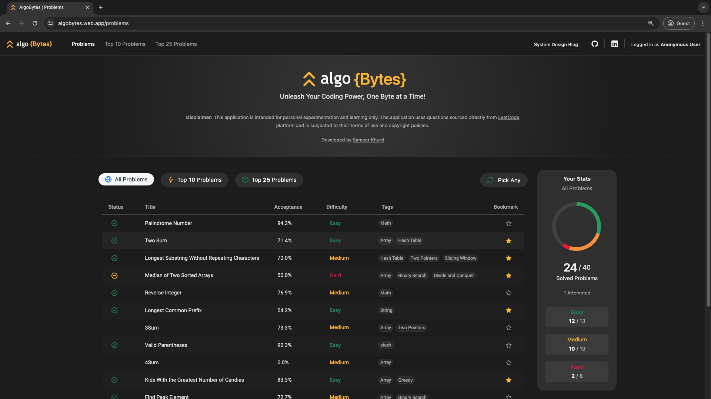
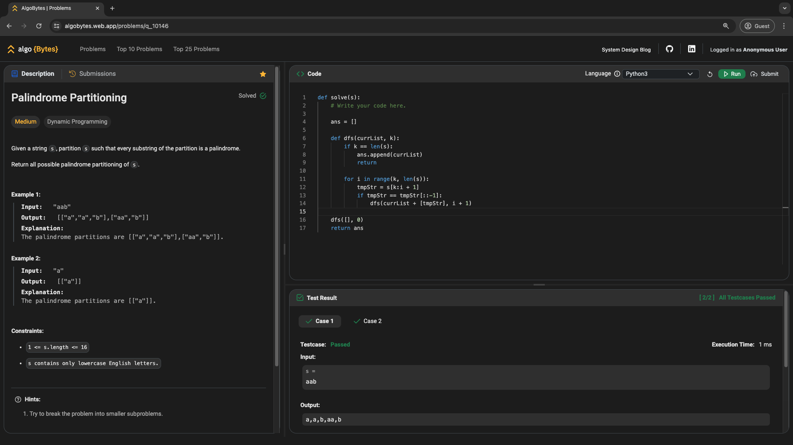
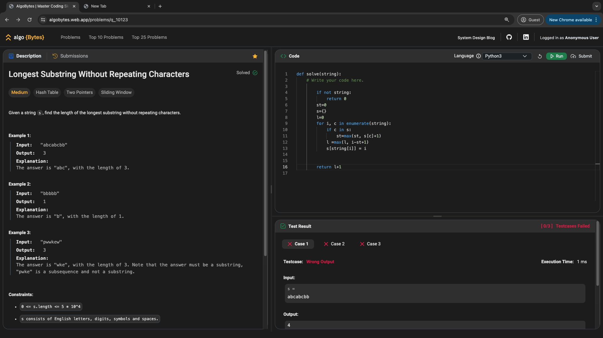
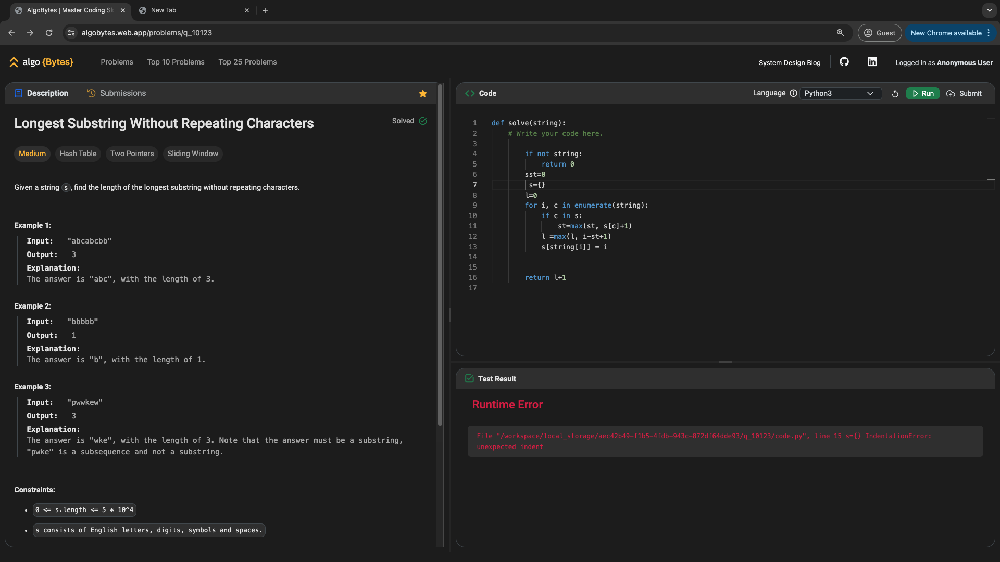

# AlgoBytes : LeetCode-like Coding Platform [Full Stack]

## Overview

This repository contains the codebase for a LeetCode-like coding platform **AlgoBytes**, designed to provide users with coding challenges and an integrated code execution environment. The platform includes user management, question management, code submission, and execution functionalities.
<br />

### Demo

Checkout&nbsp; [Live Demo : &nbsp;algobytes.web.app ](https://algobytes.web.app/)

### System Design Blog

For a detailed explanation of the system design and implementation, checkout [System Design Blog](https://medium.com/@sameerkhurd/from-design-to-demo-building-a-full-stack-leetcode-like-platform-with-system-design-4c86d61f398a).

<br />


## Contents

- [Overview](#overview)
- [Demo](#demo)
- [System Design Blog](#system-design-blog)
- [Technology Stack](#technology-stack)
- [Frontend Setup](#frontend-setup)
- [Backend Setup](#backend-setup)
- [Deployment](#deployment)
- [Contributing](#contributing)
- [Sample Questions](./sample-questions/)
- [Screenshots](#screenshots)


## Technology Stack

- **Frontend**: Angular, Bootstrap 5, PrimeNG, ngx-monaco-editor, ng2-chart
- **Backend**: Python, GCP Cloud Functions (Serverless)
- **Database**: GCP Firestore (NoSQL)
- **Hosting**: Firebase Hosting
- **APIs**: RESTful APIs


## Frontend Setup

### Prerequisites

- Node.js ([Version 20.9.0](https://nodejs.org/en/blog/release/v20.9.0))
- npm ([Version 10.1.0](https://www.npmjs.com/package/npm/v/10.1.0))
- Angular CLI ([Version 16.2.14](https://www.npmjs.com/package/@angular/cli/v/16.2.14))
- Git ([Download](https://git-scm.com/downloads))

### Installation

1. Clone the repository:
   ```sh
   git clone https://github.com/SameerKhurd/algo-bytes.git
   ```
2. Navigate to the project directory:
   ```sh
   cd algo-bytes
   ```
3. Install frontend dependencies:
   ```sh
   cd frontend/algo-bytes-web-app
   npm install --force
   ```

### Running Locally

1. Navigate to the project directory:
   ```sh
   cd algo-bytes
   ```
1. Start the frontend server:

   ```sh
   cd frontend/algo-bytes-web-app
   npm start
   ```

   or

   ```sh
   cd frontend/algo-bytes-web-app
   ng serve
   ```

## Backend Setup

### Prerequisites

- Python ([Version 3.12](https://www.python.org/downloads/release/python-3120/))
- Firebase CLI ([Installation Guide](https://firebase.google.com/docs/cli))
- Git ([Download](https://git-scm.com/downloads))

### Installation

1. Clone the repository (If not cloned the repository earlier):
   ```sh
   git clone https://github.com/SameerKhurd/algo-bytes.git
   ```
2. Navigate to the project directory:
   ```sh
    cd algo-bytes
   ```
3. Navigate to backend code directory:
   ```sh
   cd serverless-api-functions/functions
   ```
4. [Recommended] Create a virtual environment and activate it:
   ```sh
   python3.12 -m venv venv
   source venv/bin/activate
   ```
5. Install backend dependencies:
   ```sh
   pip install -r requirements.txt
   ```

### Running Locally

1. Start the backend server:
   ```sh
   cd backend
   firebase emulators:start
   ```

## Deployment

### Frontend Deployment

1. Configure GitHub Actions to build and deploy to Firebase Hosting on commits to the deploy branch.
2. GitHub Actions runners will build the package and deploy it automatically.

### Backend Deployment

1. Set up Firebase CLI and configure it for the respective project.
2. Deploy the cloud functions manually:
   ```sh
   firebase deploy --only functions
   ```

## Contributing

1. Fork the repository.
2. Create a new branch (`git checkout -b feature-branch`).
3. Make your changes and commit them (`git commit -m 'Add new feature'`).
4. Push to the branch (`git push origin feature-branch`).
5. Open a pull request.

## Screenshots

- Landing Page
  

- Question Page
  

- Question Page - Submissions
  

- Question Page - Execution Result
  

- Question Page - Wrong Result
  

- Question Page - Runtime Error Result
  
[More Screenshots](./screenshots/)
